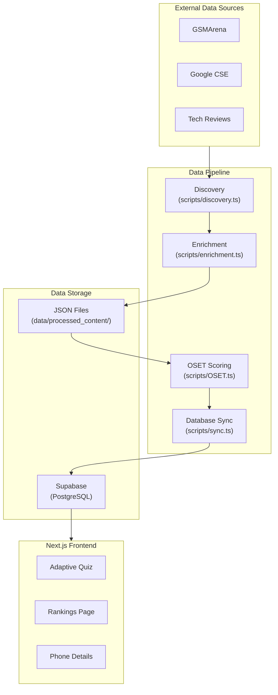

# Architecture Documentation

## System Overview

SmartMatch PWA is a full-stack Next.js application with a sophisticated data pipeline for processing smartphone reviews and generating AI-powered recommendations.



---

## Technology Stack

### Frontend
| Technology | Version | Purpose |
|------------|---------|---------|
| Next.js | 16.0.7 | React framework with App Router |
| React | 19.2.3 | UI library |
| Framer Motion | 12.23.25 | Animation library |
| Tailwind CSS | 3.4.17 | Utility-first CSS |
| Lucide React | 0.424.0 | Icon library |
| Three.js | 0.181.2 | 3D graphics (backgrounds) |

### Backend
| Technology | Version | Purpose |
|------------|---------|---------|
| Drizzle ORM | 0.45.1 | TypeScript ORM |
| PostgreSQL | - | Database (via Supabase) |
| Supabase | 2.38.0 | Backend-as-a-Service |
| Zod | 4.1.12 | Schema validation |

### Data Pipeline
| Technology | Version | Purpose |
|------------|---------|---------|
| Cheerio | 1.1.2 | HTML parsing |
| Axios | 1.13.1 | HTTP client |
| Winston | 3.18.3 | Logging |

---

## Directory Structure

```
smartmatch-pwa/
├── app/                    # Next.js App Router
│   ├── api/                # API routes
│   │   └── phone-image/    # Image serving API
│   ├── onyx/               # Main application routes
│   │   ├── details/        # Phone details page
│   │   ├── phone/[slug]/   # Dynamic phone pages
│   │   └── rankings/       # Rankings page
│   ├── globals.css         # Global styles
│   └── layout.tsx          # Root layout
│
├── components/             
│   └── onyx-ui/          # All UI components
│       ├── screens/        # Full-screen components
│       └── *.tsx           # Reusable components
│
├── lib/                    # Shared libraries
│   ├── db/                 # Database (Drizzle schema)
│   ├── onyx/               # Server actions
│   └── auth/               # Authentication (planned)
│
├── hooks/                  # React hooks
│   ├── use-reduced-motion.ts
│   └── use-high-contrast.ts
│
├── scripts/                # Data pipeline scripts
│   ├── discovery.ts        # URL discovery
│   ├── enrichment.ts       # AI content generation
│   ├── OSET.ts             # Scoring algorithm
│   ├── sync.ts             # Database sync
│   └── pipeline.ts         # Orchestrator
│
├── data/                   # Data storage
│   ├── phones.json         # Master phone registry
│   ├── processed_content/  # Per-phone JSON + images
│   └── regret-sentiments.json  # User regret data
│
└── tests/                  # Test suites
```

---

## Data Flow

### 1. Discovery Phase
```
Google CSE → URLs → phones.json
```
- Collects review URLs from trusted sources
- Maps URLs to phone identifiers
- Stores in `data/phones.json`

### 2. Enrichment Phase
```
URLs → Scrape → AI Processing → processed_content/
```
- Scrapes content from each URL
- Sends to DeepSeek AI for analysis
- Generates structured JSON with scores

### 3. OSET Phase
```
Raw Scores → Normalization → Decay → Final Scores
```
- Normalizes scores across all phones (0-10)
- Applies time-based decay for older phones
- Calculates overall weighted score

### 4. Sync Phase
```
processed_content/ → Drizzle → Supabase
```
- Reads JSON files
- Transforms to database schema
- Upserts to `processed_phones` table

---

## Key Design Decisions

### 1. Static-First Architecture
All phone data is pre-processed and stored in the database. The frontend reads from Postgres, avoiding runtime AI calls.

### 2. Dual-State Data
- `processed_phones`: Raw scores from enrichment
- `dynamic_phones`: Post-OSET normalized scores

### 3. File-Based Cache
JSON files in `data/processed_content/` serve as:
- Source of truth before sync
- Backup for rollback
- Development fixtures

### 4. Server Actions
All data fetching uses Next.js Server Actions in `lib/onyx/actions.ts` for type-safe, cached queries.
