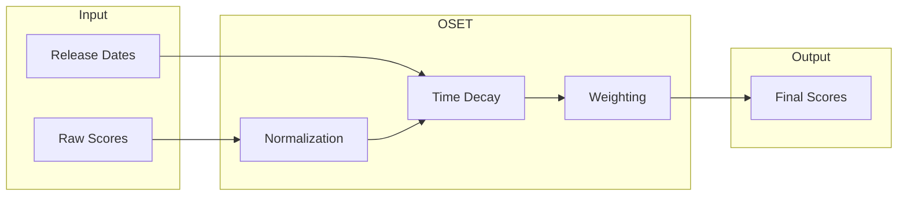

# OSET Algorithm Documentation

**O**bjective **S**coring **E**valuation **T**ransform

The OSET algorithm is the core scoring system that normalizes, weights, and applies time-decay to phone attribute scores.

---

## Overview



---

## The 7 Attributes

| Attribute | Weight | Description |
|-----------|--------|-------------|
| Camera | 0.20 | Photo/video quality, lens versatility |
| Battery Endurance | 0.15 | Battery life, charging speed |
| Performance | 0.15 | CPU/GPU benchmarks, real-world speed |
| Display | 0.15 | Brightness, refresh rate, color accuracy |
| Software Experience | 0.15 | OS fluidity, update policy, features |
| Design & Build | 0.10 | Materials, ergonomics, durability |
| Longevity Value | 0.10 | Price-to-value, repair, resale |

**Total**: 1.00

---

## Step 1: Score Collection

Raw scores come from AI enrichment (1-10 scale):

```json
{
  "originalAttributes": {
    "Camera": { "score": 8.72, "explanation": "..." },
    "Battery Endurance": { "score": 9.45, "explanation": "..." },
    "Performance": { "score": 9.28, "explanation": "..." },
    "Display": { "score": 9.61, "explanation": "..." },
    "Software Experience": { "score": 7.85, "explanation": "..." },
    "Design & Build": { "score": 9.18, "explanation": "..." },
    "Longevity Value": { "score": 7.30, "explanation": "..." }
  }
}
```

---

## Step 2: Cross-Phone Normalization

Scores are normalized relative to all phones in the dataset.

### Formula

```
normalized = ((raw - min) / (max - min)) * 10
```

### Example

For Camera scores across 50 phones:
- Min score: 5.2
- Max score: 9.8
- Raw score for Phone X: 8.72

```
normalized = ((8.72 - 5.2) / (9.8 - 5.2)) * 10
           = (3.52 / 4.6) * 10
           = 7.65
```

### Clamping

Final normalized score is clamped to [0, 10]:
```typescript
const clamped = Math.max(0, Math.min(10, normalized));
```

---

## Step 3: Time-Based Decay

Older phones receive score penalties to reflect technological depreciation.

### Decay Formula

```typescript
const ageMonths = getAgeInMonths(releaseDate);
const decayFactor = Math.exp(-DECAY_RATE * ageMonths);
const decayedScore = score * decayFactor;
```

### Decay Rates by Attribute

| Attribute | Decay Rate | Rationale |
|-----------|------------|-----------|
| Performance | 0.015 | Tech advances rapidly |
| Camera | 0.012 | Computational photography evolves |
| Display | 0.010 | Refresh rates, brightness improve |
| Software | 0.008 | Updates extend relevance |
| Battery | 0.008 | Capacity improvements steady |
| Design | 0.005 | Aesthetic is timeless |
| Longevity | 0.005 | Value compounds over time |

### Decay Curve

```
Age (months)    Decay Factor (Performance)
0               1.00
6               0.91
12              0.84
18              0.76
24              0.70
36              0.58
```

---

## Step 4: Weighted Overall Score

```typescript
const overallScore = 
    camera * 0.20 +
    battery * 0.15 +
    performance * 0.15 +
    display * 0.15 +
    software * 0.15 +
    design * 0.10 +
    longevity * 0.10;
```

---

## Step 5: Output

Normalized + decayed scores are stored in `attributes`:

```json
{
  "originalAttributes": { ... },  // Raw from enrichment
  "attributes": {                  // Post-OSET
    "Camera": { "score": 6.13, "explanation": "..." },
    "Battery Endurance": { "score": 10, "explanation": "..." },
    // ...
  },
  "overallScore": 8.77  // Weighted final
}
```

---

## Configuration

In `scripts/OSET.ts`:

```typescript
const ATTRIBUTE_WEIGHTS = {
    "Camera": 0.20,
    "Battery Endurance": 0.15,
    "Performance": 0.15,
    "Display": 0.15,
    "Software Experience": 0.15,
    "Design & Build": 0.10,
    "Longevity Value": 0.10
};

const DECAY_RATES = {
    "Camera": 0.012,
    "Battery Endurance": 0.008,
    "Performance": 0.015,
    "Display": 0.010,
    "Software Experience": 0.008,
    "Design & Build": 0.005,
    "Longevity Value": 0.005
};

const NORMALIZATION_PERCENTILE = 0.95; // Exclude outliers
```

---

## Brand Overrides

Some brands have adjusted weights based on brand identity:

```typescript
const BRAND_OVERRIDES = {
    "apple": {
        "Software Experience": 0.20,  // iOS ecosystem premium
        "Performance": 0.12           // Adjust down
    },
    "google": {
        "Camera": 0.25,              // Pixel camera priority
        "Software Experience": 0.20
    },
    "samsung": {
        "Display": 0.20              // Display excellence
    }
};
```

---

## Running OSET

```bash
# Run OSET phase
npm run pipeline:oset

# Or as part of full pipeline
npm run pipeline
```

### Output Logs

```
[OSET] Loading 52 phones...
[OSET] Calculating normalization bounds...
[OSET] Camera: min=5.2, max=9.8
[OSET] Applying decay for apple_iphone_15_pro (age: 15 months)
[OSET] Final score: 8.45 → 7.92 (after decay)
[OSET] Saved 52 phones
```

---

## Validation

OSET includes self-validation:

```typescript
// Score sanity checks
if (overallScore < 0 || overallScore > 10) {
    logger.warn(`Invalid score for ${phoneId}: ${overallScore}`);
}

// Attribute completeness
const missing = REQUIRED_ATTRIBUTES.filter(a => !phone.attributes[a]);
if (missing.length > 0) {
    logger.warn(`Missing attributes for ${phoneId}: ${missing.join(', ')}`);
}
```

---

## Future Enhancements

1. **User Feedback Loop**: Adjust weights based on user upvotes
2. **Regional Pricing**: Include price normalization
3. **Regret Integration**: Factor in regret scores
4. **Category-Specific Weights**: Different weights for flagships vs budget
