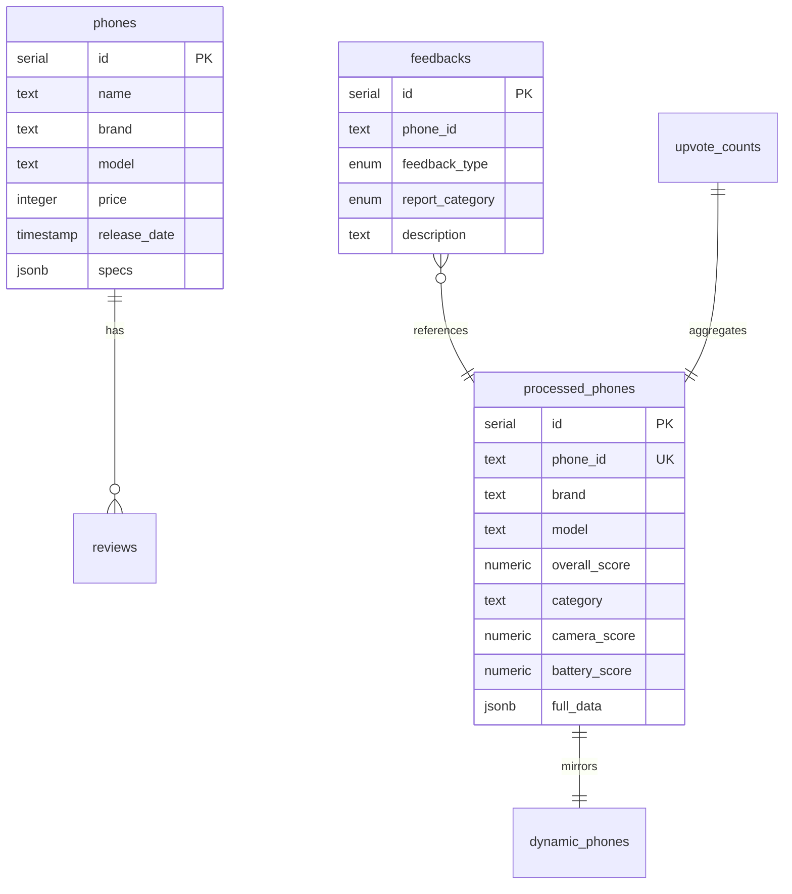

# Database Schema Documentation

Complete reference for the SmartMatch database schema.

---

## Overview

SmartMatch uses **Supabase** (PostgreSQL) with **Drizzle ORM**.



---

## Tables

### phones

Core product data (not actively used in current implementation).

| Column | Type | Description |
|--------|------|-------------|
| `id` | serial | Primary key |
| `name` | text | Full display name |
| `brand` | text | e.g., "Apple", "Samsung" |
| `model` | text | e.g., "iPhone 15 Pro" |
| `price` | integer | Price in cents |
| `release_date` | timestamp | Release date |
| `image_url` | text | Hero image URL |
| `specs` | jsonb | Raw specifications |
| `ai_summary` | text | AI-generated summary |
| `created_at` | timestamp | Record creation |
| `updated_at` | timestamp | Last update |

---

### processed_phones

Main table for enriched phone data (pre-OSET scores).

| Column | Type | Description |
|--------|------|-------------|
| `id` | serial | Primary key |
| `phone_id` | text | Unique identifier (e.g., "apple_iphone_15_pro") |
| `brand` | text | Brand name |
| `model` | text | Model name |
| `release_date` | timestamp | Phone release date |
| `overall_score` | numeric(4,2) | 0-10 score |
| `category` | text | "flagship", "premium", "midrange", "budget" |
| `summary` | text | One-page summary |
| `pros` | text | Pros (newline-separated) |
| `cons` | text | Cons (newline-separated) |
| `camera_score` | numeric(4,2) | Camera attribute score |
| `battery_score` | numeric(4,2) | Battery attribute score |
| `performance_score` | numeric(4,2) | Performance attribute score |
| `display_score` | numeric(4,2) | Display attribute score |
| `software_score` | numeric(4,2) | Software attribute score |
| `design_score` | numeric(4,2) | Design attribute score |
| `longevity_score` | numeric(4,2) | Longevity/value score |
| `camera_main` | text | Main camera description |
| `camera_telephoto` | text | Telephoto capabilities |
| `camera_video` | text | Video features |
| `last_processed_at` | timestamp | Last enrichment run |
| `enrichment_status` | text | "completed", "failed", "pending" |
| `facts_version` | text | Processing version (e.g., "v7-Final") |
| `confidence` | integer | AI confidence (0-100) |
| `processing_time_ms` | integer | Enrichment duration |
| `full_data` | jsonb | Complete enrichment JSON |
| `created_at` | timestamp | Record creation |
| `updated_at` | timestamp | Last update |

**Unique Constraint**: `phone_id`

---

### dynamic_phones

Post-OSET normalized scores (same schema as processed_phones).

This table contains:
- Normalized attribute scores (0-10 scale relative to all phones)
- Time-decayed scores based on phone age
- Recalculated overall score with weights

---

### feedbacks

User feedback (upvotes and reports).

| Column | Type | Description |
|--------|------|-------------|
| `id` | serial | Primary key |
| `phone_id` | text | Phone identifier |
| `feedback_type` | enum | "upvote" or "report" |
| `report_category` | enum | Report category (nullable) |
| `description` | text | Report description (nullable) |
| `created_at` | timestamp | Submission time |
| `user_ip` | text | Hashed IP for rate limiting |

**Report Categories**:
- `wrong_score`
- `wrong_spec`
- `outdated_info`
- `missing_info`
- `other`

---

### upvote_counts

Aggregated upvote counts per phone (for performance).

| Column | Type | Description |
|--------|------|-------------|
| `phone_id` | text | Primary key |
| `count` | integer | Total upvotes |
| `updated_at` | timestamp | Last update |

---

### processing_metadata

Pipeline performance tracking.

| Column | Type | Description |
|--------|------|-------------|
| `id` | serial | Primary key |
| `total_processed_phones` | integer | Total phones processed |
| `last_updated` | timestamp | Last run time |
| `avg_processing_time` | integer | Avg ms per phone |
| `total_deepseek_calls` | integer | Total AI API calls |
| `avg_confidence` | integer | Avg confidence % |
| `created_at` | timestamp | Record creation |

---

### reviews

Aggregated reviews from external sources.

| Column | Type | Description |
|--------|------|-------------|
| `id` | serial | Primary key |
| `phone_id` | integer | FK to phones.id |
| `source` | text | e.g., "GSMArena" |
| `url` | text | Review URL |
| `author` | text | Reviewer name |
| `rating` | integer | Normalized 0-100 |
| `summary` | text | Review summary |
| `sentiment` | text | "positive", "neutral", "negative" |
| `published_at` | timestamp | Publish date |
| `created_at` | timestamp | Record creation |

---

## Drizzle Schema

Located in `lib/db/schema.ts`:

```typescript
import { pgTable, serial, text, numeric, jsonb, timestamp } from 'drizzle-orm/pg-core';

export const processedPhones = pgTable('processed_phones', {
    id: serial('id').primaryKey(),
    phone_id: text('phone_id').notNull().unique(),
    brand: text('brand').notNull(),
    model: text('model').notNull(),
    overall_score: numeric('overall_score', { precision: 4, scale: 2 }),
    // ... more columns
    full_data: jsonb('full_data'),
});
```

---

## Migrations

Migrations are managed by Drizzle Kit.

```bash
# Generate migration from schema changes
npm run db:generate

# Apply migrations
npm run db:migrate

# Reset database (DESTRUCTIVE)
npm run db:reset
```

Migration files: `drizzle/*.sql`

---

## Indexes

Recommended indexes for performance:

```sql
-- Fast phone lookup
CREATE INDEX idx_processed_phones_phone_id ON processed_phones(phone_id);

-- Rankings sorting
CREATE INDEX idx_processed_phones_overall_score ON processed_phones(overall_score DESC);

-- Category filtering
CREATE INDEX idx_processed_phones_category ON processed_phones(category);

-- Feedback aggregation
CREATE INDEX idx_feedbacks_phone_id ON feedbacks(phone_id);
```

---

## Connection

Database connection in `lib/db/index.ts`:

```typescript
import { drizzle } from 'drizzle-orm/postgres-js';
import postgres from 'postgres';

const connectionString = process.env.DATABASE_URL!;
const client = postgres(connectionString);
export const db = drizzle(client);
```

---

## Backup Strategy

1. **JSON Files**: `data/processed_content/` serves as file-based backup
2. **full_data Column**: Complete JSON stored in database
3. **Supabase Backups**: Automatic daily backups (Supabase Pro)

To restore from JSON:
```bash
npm run pipeline:sync
```
