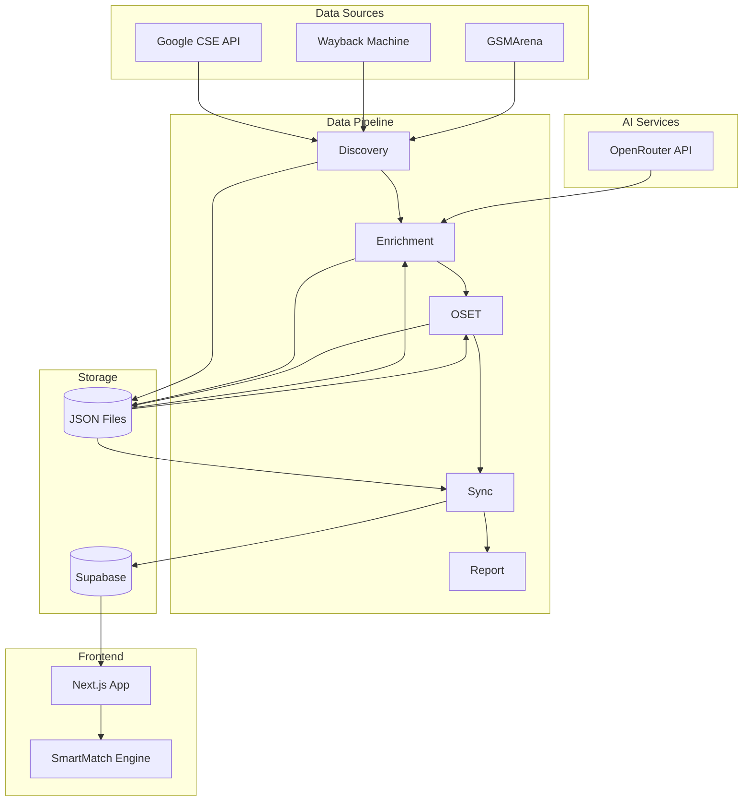
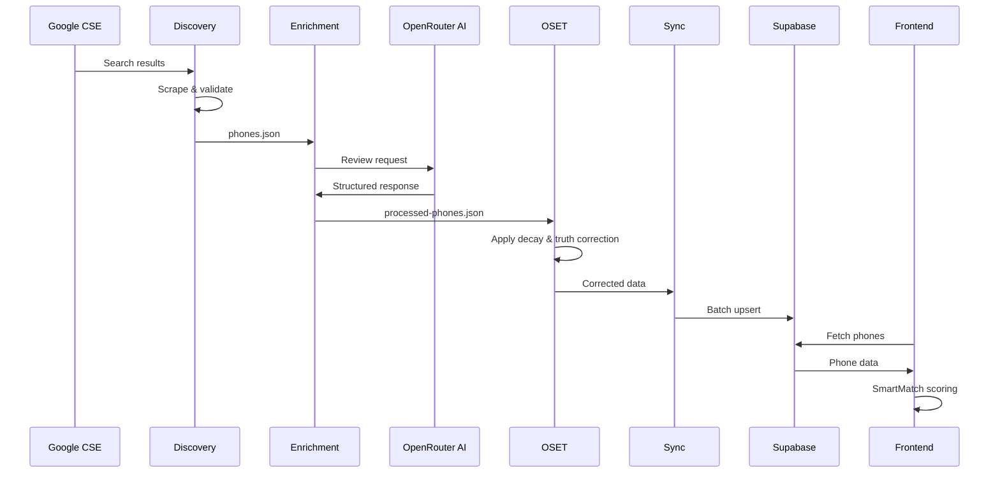

# SmartMatch PWA - Architecture

## System Overview

SmartMatch is an AI-powered phone review generation and recommendation system with a destiny-based matching engine.



## Pipeline Stages

### 1. Discovery (`scripts/discovery.ts`)
- Fetches phone data from Google Custom Search API
- Retrieves archived content from Wayback Machine
- Scrapes specifications from GSMArena
- Extracts release dates and validates content quality
- **Output**: `data/phones.json`

### 2. Enrichment (`scripts/enrichment.ts`)
- Sends scraped content to OpenRouter AI
- Generates structured reviews with 7 attributes
- Applies attribute weighting and regret analysis
- **Output**: `data/processed-phones.json`

### 3. OSET - Opinion Score Enhancement & Truthing (`scripts/OSET.ts`)
- Applies decay rates based on data freshness
- Performs truth correction on scores
- Preserves original scores for comparison
- **Output**: Updated `data/processed-phones.json`

### 4. Sync (`scripts/sync.ts`)
- Exports data to Supabase (PostgreSQL)
- Maintains two tables: `processed_phones` (raw) and `dynamic_phones` (enriched)
- Handles batch upserts with retry logic

### 5. Report (`scripts/generate-report.ts`)
- Generates pipeline execution summary
- Logs performance metrics

## Key Design Decisions

### Why Drizzle ORM?
- Type-safe database operations with TypeScript
- Lightweight compared to Prisma
- Clean migration system
- Direct SQL access when needed

### Why OpenRouter?
- Access to multiple AI models through single API
- Fallback capability across providers
- Cost optimization through model selection

### Why Atomic File Operations?
- Prevents data corruption on crash
- Uses write-temp-then-rename pattern
- Ensures pipeline can resume from any failure point

### Why Supabase?
- PostgreSQL with real-time capabilities
- Generous free tier
- Built-in authentication (future use)
- Edge function support

## Data Flow



## SmartMatch Engine

The destiny-based recommendation system uses:

1. **Archetype Detection**: Maps user preferences to archetypes
2. **Base Scoring**: Weighted attribute calculation
3. **Emotional Resonance**: Multiplier based on archetype match
4. **Regret Minimization**: Penalty for known pain points
5. **Destiny Override**: Special handling for exceptional matches

### Scoring Formula
```
finalScore = (baseScore + archetypeBonus) * emotionalResonance + regretPenalty
```

## Error Handling

All pipeline operations use structured error handling:

- `PipelineError`: Base error class with phase, category, severity
- `CircuitBreaker`: Prevents cascade failures
- `withRetry()`: Exponential backoff with jitter
- Automatic failure logging to `data/failures.json`

## File Structure

```
smartmatch-pwa/
├── app/                 # Next.js pages
├── components/          # React components
│   └── SmartMatch/       # SmartMatch UI components
├── data/                # Pipeline data storage
│   ├── phones.json      # Raw phone data
│   └── processed-phones.json  # Enriched data
├── lib/                 # Shared utilities
│   ├── errors.ts        # Error handling
│   ├── retry.ts         # Retry utilities
│   └── io.ts            # File I/O
├── scripts/             # Pipeline scripts
├── src/lib/             # Frontend utilities
│   └── SmartMatch.ts     # Recommendation engine
└── drizzle/             # Database migrations
```

## CI/CD Pipeline

GitHub Actions workflow runs daily:
1. Discovery (if data is stale)
2. Enrichment
3. OSET truth correction
4. Sync to Supabase
5. Auto-commit changes
6. Failure notifications via GitHub Issues

See: [.github/workflows/smartmatch-pipeline.yml](.github/workflows/smartmatch-pipeline.yml)
