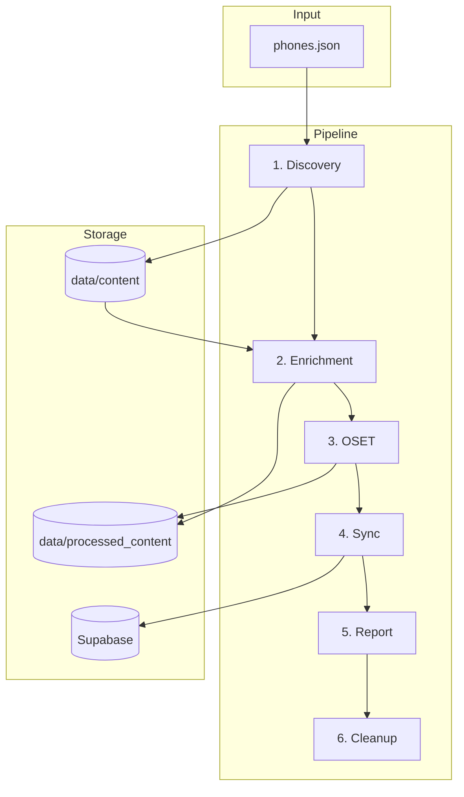

# Pipeline Scripts

## Core Pipeline

| Script | Purpose |
|--------|---------|
| `pipeline.ts` | Orchestrates all steps with retry logic |
| `discovery.ts` | Scrapes phone reviews from web sources |
| `enrichment.ts` | AI-powered analysis of reviews via OpenRouter |
| `OSET.ts` | Normalizes scores to 2025 benchmarks |
| `sync.ts` | Syncs data to Supabase |
| `generate-report.ts` | Creates PIPELINE_REPORT.md |

## Running

```bash
# Full pipeline (recommended)
npm run pipeline

# Full pipeline with git sync
npm run pipeline:full

# Individual steps
npm run pipeline:discover
npm run pipeline:enrich
npm run pipeline:sync
```

## Configuration

| Env Variable | Required | Purpose |
|--------------|----------|---------|
| `OPENROUTER_API_KEY` | Yes | AI enrichment |
| `SUPABASE_URL` | Yes | Database sync |
| `SUPABASE_SERVICE_KEY` | Yes | Database auth |
| `GOOGLE_CSE_ID` | No | Custom search (falls back to DuckDuckGo) |

## Architecture



## Data Flow

| Step | Input | Output |
|------|-------|--------|
| Discovery | `phones.json` | `data/content/*.txt` |
| Enrichment | `data/content/*.txt` | `data/processed_content/*.json` |
| OSET | `processed_content/*.json` | Score normalization |
| Sync | `processed_content/*.json` | Supabase tables |
| Report | Pipeline metrics | `PIPELINE_REPORT.md` |
| Cleanup | `logs/` | Keeps last 5 logs per type |
